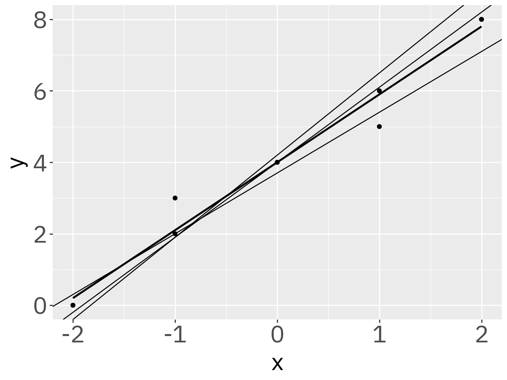
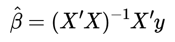
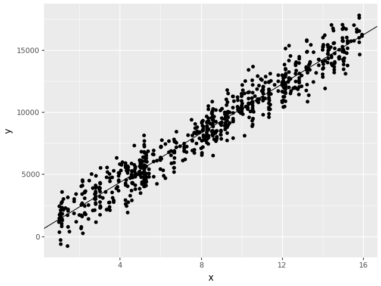

+++
date = '2025-11-17T15:16:52-03:00'
draft = false
title = 'Regressão Linear'
description = "Estudo sobre regressão linear no NumPy. "
+++

A primeira atividade realizada para este projeto foi um estudo sobre regressões lineares. Mais especificamente, como é possível realizar essa operação usando Python e NumPy.

# A matemática

A regressão linear é, basicamente, uma forma de estimar o valor de uma variável tendo como base uma sequência de dados preexistentes. Esses dados preexistentes são, pelo que vi, uma lista de pontos (ou pares ordenados), cada um com uma variável `x` (a "independente") e uma variável `y` (a "dependente").

Assim, o nosso objetivo é, dado um valor de `x`, achar o valor mais provável de `y`. Graças à Matemática, podemos fazer isso usando a equação `f(x) = a * x + b`, que é uma equação de reta. Vejamos como isso seria em um gráfico:



Nesse gráfico, podemos ver alguns pontos espalhados e um reta que passa entre eles. Pense nessa reta como uma espécie de média, de modo que a inclinação dela é a média das inclinações que ela precisaria ter para atravessar cada um dos pontos individualmente.

> Ignore o fato de haver mais de uma reta nesse gráfico. As outras retas são as possíveis regressões caso não usemos todos os pontos.

Desse modo, a função da regressão linear é nos dar os valores de `a` e `b` para que encontremos a tal reta "média".

Em linguagem matemática, a regressão linear possui este formato:



Aqui, o resultado "beta" é uma matriz de formato `[a, b]`, onde `a` e `b` são os coeficientes da nossa reta. `X` e `y` são as matrizes que contém os valores que já conhecemos, sendo que `X` contém os valores de `x` e `y` contém os valores de `y`.

Um ponto interessante a se lembrar é que cada valor de `x` será representado como `[1, x]` dentro da matriz `X`. Isso permite que calculemos o `b`.

# O desafio

O desafio proposto foi o seguinte: Dados os [valores de `x`](./X.txt) e os [valores de `y`](./y.txt), calcule os coeficientes `a` e `b` usando regressão linear e produza um gráfico com os pontos e a reta.

# O código

Para resolver esse desafio, foi recomendado o uso das bibliotecas NumPy, Pandas e Plotnine, então foi o que usei.

Primeiramente, precisamos definir a função de calculará a regressão linear, o coração do nosso projeto. Eis aqui a função que escrevi para isso:

```Python
def linear_regression(x, y):
    return np.dot(np.dot(np.linalg.inv(np.dot(np.transpose(x), x)), np.transpose(x)), y)
```

Isso é apenas uma transcrição da função matemática que coloquei na primeira seção. É um pouco difícil de enxergar, mas é.

# Os resultados



Aqui está o código completo, se te interessar:

```Python
import numpy as np
import pandas as pd

from plotnine import (
    ggplot,
    aes,
    geom_point,
    geom_abline,
)


def linear_regression(x, y):
    return np.dot(np.dot(np.linalg.inv(np.dot(np.transpose(x), x)), np.transpose(x)), y)


def main():
    df_x: list[float] = []
    X: list[list[float]] = []
    with open("./X.txt") as file:
        for line in file.readlines():
            num = float(line)
            df_x.append(num)
            X.append([1.0, num])

    y: list[float] = []
    with open("./y.txt") as file:
        for line in file.readlines():
            y.append(float(line))

    a, b = linear_regression(X, y)

    df = pd.DataFrame({"x": df_x, "y": y})

    (
        ggplot(pd.DataFrame(df), aes("x", "y"))
        + geom_point()
        + geom_abline(intercept=a, slope=b)
    ).save("grafico.png")


if __name__ == "__main__":
    main()
```