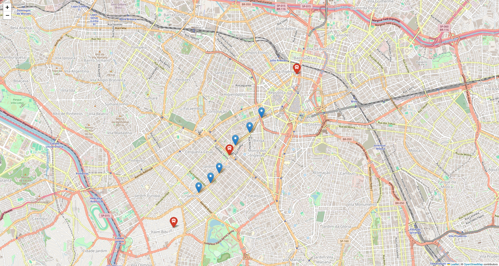

+++
date = '2025-11-17T16:23:52-03:00'
draft = false
title = 'Frotas de Ônibus'
description = "Estudo de APIs."
+++

A segunda atividade realizada para este projeto foi um estudo sobre o uso de APIs. Mais especificamente, como é possível utilizar a API do [Olho Vivo](https://www.sptrans.com.br/desenvolvedores/api-do-olho-vivo-guia-de-referencia/), disponibilizada pela SPTrans, para consultar as paradas e os carros de uma linha de ônibus (ou metrô).

# O desafio

O desafio foi o seguinte: Usando a API do Olho Vivo, construir um mapa com as posições das paradas de uma linha de ônibus, além das posições dos ônibus no momento de execução do código. As paradas e as posições devem ser indicadas com marcadores de cores diferentes.

# O código

Primeiramente, eu decidi criar um módulo separado para o uso da API, já que seria necessário usar vários _endpoints_ diferentes. Então, no arquivo `api.py`, eu comecei com o seguinte código:

```Python
load_dotenv("./.env")

session = requests.Session()
```

Eu guardei o meu token em um arquivo chamado `.env` e usarei o método `os.getenv()` quando precisar dele. Por isso, é necessário usar a função `load_dotenv()` para carregá-lo ao iniciar o programa.

Além disso, eu iniciei uma sessão do `requests`, já que é necessário se autenticar para usar a API. Sem uma sessão, é possível que o cookie de autenticação não seja guardado para operações futuras.

Em seguida, eu criei a função que autenticará a sessão usando o token e um request de tipo `POST`:

```Python
def autenticar() -> bool:
    print("Autenticando...")

    res = session.post(
        f"http://api.olhovivo.sptrans.com.br/v2.1/Login/Autenticar?token={os.getenv('SPTRANS_TOKEN')}"
    )

    if res.text.lower() == "true":
        print("Autenticado com sucesso.")
        return True
    else:
        print("Falha na autenticação.")
        return False
```

Note que a API retornará `"true"` ou `"false"` dependendo do resultado da autenticação. Podemos utilizar isso para parar a execução do programa caso a autenticação falhe.

Após isso, eu escrevi as funções de busca de linhas, paradas e posições, cada uma usando um request de tipo `GET`:

```Python
def buscar_linhas(termo: str) -> list[dict]:
    print("Procurando por linhas de", termo)

    res = session.get(
        f"http://api.olhovivo.sptrans.com.br/v2.1/Linha/Buscar?termosBusca={termo}"
    )

    return res.json()


def buscar_paradas(codigo: str, log: bool = True) -> list[dict]:
    if log:
        print("Procurando por paradas na linha", codigo)

    res = session.get(
        f"http://api.olhovivo.sptrans.com.br/v2.1/Parada/BuscarParadasPorLinha?codigoLinha={codigo}"
    )

    return res.json()


def buscar_posicoes(codigo: str, log: bool = True) -> list[dict]:
    if log:
        print("Procurando por posições na linha", codigo)

    res = session.get(
        f"http://api.olhovivo.sptrans.com.br/v2.1/Posicao/Linha?codigoLinha={codigo}"
    )

    return res.json()["vs"]
```

Todas elas possuem um formato similar, então não vejo sentido em comentar sobre cada uma individualmente.

Mesmo assim, é importante notar que, em `buscar_posicoes()`, eu retorno `res.json()["vs"]`, e não apenas `res.json()`, como nas outras. Isso é porque nos interessam apenas os veículos, guardados na lista `"vs"`.

Já com as funções que precisamos em mão, agora podemos começar a obter as informações que precisamos. Farei isso no arquivo `main.py`.

O primeiro passo é autenticar a sessão, parando a execução caso isso falhe:

```Python
def main():
    if not api.autenticar():
        return
```

Em seguida, podemos pesquisar pelas linhas que satisfazem um termo. No meu caso, escolhi o Metrô Santana, que pode ser identificado pelo termo "Santana".

```Python
def main():
    if not api.autenticar():
        return

    TERMO = "Santana" # Metrô Santana

    linhas = api.buscar_linhas(TERMO)

    print("Foram encontradas", len(linhas), "linhas para o termo", TERMO)
```

Agora, podemos começar a obter as informações que precisamos sobre uma linha. Entretanto, enquanto escrevia o programa, me deparei com um problema: Nem todas as linhas retornadas por `api.buscar_linhas()` possuem tanto paradas quanto veículos. Na verdade, várias delas não possuem nenhum dos dois.

Por isso, decidi que seria melhor se eu procurasse até achar uma linha que possuía ambos. Isso não é tão difícil se usarmos um loop `for`.

```Python
def main():
    if not api.autenticar():
        return

    TERMO = "Santana" # Metrô Santana

    linhas = api.buscar_linhas(TERMO)

    print("Foram encontradas", len(linhas), "linhas para o termo", TERMO)
    print("Procurando uma linha válida...")

    paradas = []
    posicoes = []

    for linha in linhas:
        paradas = api.buscar_paradas(linha["cl"], False)
        posicoes = api.buscar_posicoes(linha["cl"], False)

        if len(paradas) > 0 and len(posicoes) > 0:
            print("Linha válida encontrada:", linha["tp"], "-", linha["ts"])
            break

    if len(paradas) == 0 or len(posicoes) == 0:
        print("Não foi encontrada uma linha válida.")
        return
```

Como você pode ver, paramos o loop se acharmos uma linha que possui tanto alguma parada quanto alguma posição de veículo. Se, ao terminar o loop, não tivermos o que precisamos, podemos interromper a execução do programa.

Note que pesquisamos por paradas e posições usando o valor `linha["cl"]`, que corresponde ao código da linha. Além disso, `linha["tp"]` é o terminal principal, enquanto `linha["ts"]` é o terminal secundário.

Enfim, podemos começar a construir o mapa. Para isso, usamos a biblioteca Folium.

Começamos com uma função que criará o objeto do mapa, inicialmente posicionado na primeira parada:

```Python
def criar_mapa(paradas: list[dict], posicoes: list[dict] = []) -> Map:
    mapa = Map([paradas[0]["py"], paradas[0]["px"]], zoom_start=14)
```

Note que escreverei essa função no módulo `mapas.py` do meu projeto.

Em seguida, podemos adicionar um marcador para cada parada:

```Python
def criar_mapa(paradas: list[dict], posicoes: list[dict] = []) -> Map:
    mapa = Map([paradas[0]["py"], paradas[0]["px"]], zoom_start=14)

    for parada in paradas:
        Marker(location=[parada["py"], parada["px"]], popup=parada["np"]).add_to(mapa)
```

E um marcador para cada posição de veículo:

```Python
def criar_mapa(paradas: list[dict], posicoes: list[dict] = []) -> Map:
    mapa = Map([paradas[0]["py"], paradas[0]["px"]], zoom_start=14)

    for parada in paradas:
        Marker(location=[parada["py"], parada["px"]], popup=parada["np"]).add_to(mapa)

    for pos in posicoes:
        marker = Marker(location=[pos["py"], pos["px"]], popup=pos["p"]).add_to(mapa)
        Icon("red", "white", "bus", prefix="fa").add_to(marker)
```

Para os veículos, decidi usar um marcador vermelho com ícone de ônibus.

Por fim, retornamos o mapa construído no final da função:

```Python
def criar_mapa(paradas: list[dict], posicoes: list[dict] = []) -> Map:
    mapa = Map([paradas[0]["py"], paradas[0]["px"]], zoom_start=14)

    for parada in paradas:
        Marker(location=[parada["py"], parada["px"]], popup=parada["np"]).add_to(mapa)

    for pos in posicoes:
        marker = Marker(location=[pos["py"], pos["px"]], popup=pos["p"]).add_to(mapa)
        Icon("red", "white", "bus", prefix="fa").add_to(marker)

    return mapa
```

Então, na função `main()`, construímos o mapa com as informações que possuímos e o abrimos no navegador:

```Python
def main():
    if not api.autenticar():
        return

    TERMO = "Santana" # Metrô Santana

    linhas = api.buscar_linhas(TERMO)

    print("Foram encontradas", len(linhas), "linhas para o termo", TERMO)
    print("Procurando uma linha válida...")

    paradas = []
    posicoes = []

    for linha in linhas:
        paradas = api.buscar_paradas(linha["cl"], False)
        posicoes = api.buscar_posicoes(linha["cl"], False)

        if len(paradas) > 0 and len(posicoes) > 0:
            print("Linha válida encontrada:", linha["tp"], "-", linha["ts"])
            break

    if len(paradas) == 0 or len(posicoes) == 0:
        print("Não foi encontrada uma linha válida.")
        return

    mapa = mapas.criar_mapa(paradas, posicoes)
    mapa.show_in_browser()
```

# Os resultados

Executar esse código deve nos levar a uma página com o seguinte mapa:



No caso, essa foi a saída do terminal:

```
Autenticando...
Autenticado com sucesso.
Procurando por linhas de Santana
Foram encontradas 140 linhas para o termo Santana
Procurando uma linha válida...
Linha válida encontrada: ITAIM BIBI - METRÔ SANTANA
Your map should have been opened in your browser automatically.
Press ctrl+c to return.
```

Aqui está o código completo, se te interessar:

```Python
# main.py

import api
import mapas


def main():
    if not api.autenticar():
        return

    TERMO = "Santana" # Metrô Santana

    linhas = api.buscar_linhas(TERMO)

    print("Foram encontradas", len(linhas), "linhas para o termo", TERMO)
    print("Procurando uma linha válida...")

    paradas = []
    posicoes = []

    for linha in linhas:
        paradas = api.buscar_paradas(linha["cl"], False)
        posicoes = api.buscar_posicoes(linha["cl"], False)

        if len(paradas) > 0 and len(posicoes) > 0:
            print("Linha válida encontrada:", linha["tp"], "-", linha["ts"])
            break

    if len(paradas) == 0 or len(posicoes) == 0:
        print("Não foi encontrada uma linha válida.")
        return

    mapa = mapas.criar_mapa(paradas, posicoes)
    mapa.show_in_browser()


if __name__ == "__main__":
    main()
```

```Python
# api.py

import os
import requests
from dotenv import load_dotenv


load_dotenv("./.env")

session = requests.Session()


def autenticar() -> bool:
    print("Autenticando...")

    res = session.post(
        f"http://api.olhovivo.sptrans.com.br/v2.1/Login/Autenticar?token={os.getenv('SPTRANS_TOKEN')}"
    )

    if res.text.lower() == "true":
        print("Autenticado com sucesso.")
        return True
    else:
        print("Falha na autenticação.")
        return False


def buscar_linhas(termo: str) -> list[dict]:
    print("Procurando por linhas de", termo)

    res = session.get(
        f"http://api.olhovivo.sptrans.com.br/v2.1/Linha/Buscar?termosBusca={termo}"
    )

    return res.json()


def buscar_paradas(codigo: str, log: bool = True) -> list[dict]:
    if log:
        print("Procurando por paradas na linha", codigo)

    res = session.get(
        f"http://api.olhovivo.sptrans.com.br/v2.1/Parada/BuscarParadasPorLinha?codigoLinha={codigo}"
    )

    return res.json()


def buscar_posicoes(codigo: str, log: bool = True) -> list[dict]:
    if log:
        print("Procurando por posições na linha", codigo)

    res = session.get(
        f"http://api.olhovivo.sptrans.com.br/v2.1/Posicao/Linha?codigoLinha={codigo}"
    )

    return res.json()["vs"]
```

```Python
# mapas.py

from folium import Icon, Map, Marker


def criar_mapa(paradas: list[dict], posicoes: list[dict] = []) -> Map:
    mapa = Map([paradas[0]["py"], paradas[0]["px"]], zoom_start=14)

    for parada in paradas:
        Marker(location=[parada["py"], parada["px"]], popup=parada["np"]).add_to(mapa)

    for pos in posicoes:
        marker = Marker(location=[pos["py"], pos["px"]], popup=pos["p"]).add_to(mapa)
        Icon("red", "white", "bus", prefix="fa").add_to(marker)

    return mapa
```